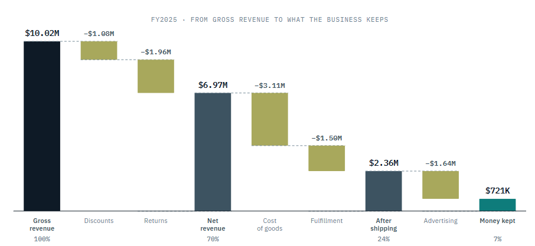

# Northlane Supply Co. — Contribution Margin Analytics

**Cristina Crespo Barreda** · data analytics, data science, ML engineering
[c.crespobarreda@gmail.com](mailto:c.crespobarreda@gmail.com)

An end-to-end analytics build for a fictional US DTC apparel brand: synthetic data
generation, a tested dbt pipeline on Postgres, and a reconciliation harness that
proves the pipeline recovers correct figures from a deliberately corrupted source
export.

**[View the live report →](https://ccrespobarreda-ctrl.github.io/northlane-analytics/)**


---

## What this demonstrates

The findings are designed into the data on purpose, so *finding them* proves
nothing. What the repository actually demonstrates is the machinery that survives
contact with bad data:

| | |
|---|---|
| **Reconciliation harness** | Compares every mart figure against ground truth. Verified by sabotage: with deduplication disabled, all 100 dbt tests still passed while $42,457 of revenue was invented. The harness caught it and failed 11 of 15 metrics. |
| **Leakage control** | The generator's own label for the defective SKUs is dropped in staging, so no downstream model can reach it. The analysis rediscovers both SKUs from return behavior and contribution alone. |
| **Versioned unit costs** | SCD Type 2 dimension joined on the cost version valid at each order date, not the current one. Joining on current would silently rewrite two years of margin history. |
| **Refusal to over-report** | No contribution margin after advertising by state or SKU. Ad platforms do not report spend at those grains, so the measure returns blank rather than an allocation dressed as a measurement. |
| **Deliberate data defects** | Eight classes of corruption injected on export — duplicate orders, orphaned foreign keys, three date formats, decimal-point typos — each with a documented resolution and its dollar impact. |

### Two things changed during the build

The margin denominator was wrong until it was checked against DTC convention:
"net revenue" means after discounts *and* returns, and using the pre-return
figure understated every margin by roughly 8 points.

The reconciliation tolerance was a single 0.5% band until a sabotage test — 
disabling the deduplication on purpose — showed it let a **$42,457 revenue
overstatement pass**. It is now split into an exact class (0.01%, for row counts
and revenue, which must survive cleaning untouched) and an imputed class (0.1%,
for the cost-derived figures that carry known variance from five imputed unit
costs). With the classes split, the same sabotage fails 11 of 15 metrics.

**Stack:** Python · PostgreSQL · dbt Core · SQL · hand-built SVG · GitHub Actions

> The dataset is synthetic and Northlane Supply Co. does not exist. The generator
> is in the repository, including the model of shipping zones, dimensional weight,
> returns disposition and per-channel attribution overstatement that makes the
> economics behave realistically.

---

## Live demo

**[View the dashboard →](https://ccrespobarreda-ctrl.github.io/northlane-analytics/)**

A single self-contained page, hand-built SVG, no charting library, no build step.
Works on a phone and offline. Deploying it is one setting: GitHub → Settings →
Pages → Source: `main` branch, `/docs` folder. That is why the page lives in
`docs/`.

```bash
REPO_URL=https://github.com/you/northlane-analytics make dashboard
make serve      # preview at localhost:8000
```

Three things worth knowing about how it is built:

**No figure is typed into the HTML.** `src/export_dashboard_data.py` queries the
marts into a JSON payload; `src/build_dashboard.py` injects it into
`docs/index.template.html`. Even the prose is derived — an early draft asserted
that "several months fall below zero", and the data says exactly one does, so the
sentence now counts them. A refresh is `make dashboard`, not an editing session.

**The data is embedded, not fetched.** No CORS, no loading state, no failure mode
to design around. The page opens from `file://` as readily as from Pages.

**A broken chart cannot blank the page.** Each renderer runs inside its own
try/catch, `.reveal` only hides content once JavaScript is confirmed running, and
a timeout reveals anything still hidden after 2.5s. Verified against five
scenarios: intact payload, two kinds of corrupted payload, an environment with no
`matchMedia` or `IntersectionObserver`, and JavaScript disabled entirely. The
page renders in all five.

---

## Report layer

The `.pbix` is built by hand in Power BI Desktop — there is no reliable way to
author one programmatically. Everything that makes building it mechanical is
specified:

| Document | Contents |
|---|---|
| [`powerbi/data_model.md`](powerbi/data_model.md) | Relationships with cardinality, which columns to hide and why, the inactive returns-to-calendar relationship, satellite-table handling, page-by-page visual spec |
| [`powerbi/dax_measures.md`](powerbi/dax_measures.md) | 45 measures with the business logic behind each |
| [`powerbi/golden_values.md`](powerbi/golden_values.md) | Expected value for every measure, regenerated by `make golden` |

Two modeling decisions worth reading:

**`fct_returns[return_date_key] → dim_date` is inactive.** Returns reach the
calendar through `fct_order_lines`, giving the *original order date* — correct
for margin. A cash-basis view activates the second path explicitly with
`USERELATIONSHIP`. Two active paths would make every refund figure ambiguous.

**`[CM3]` returns blank when filtered by state, category or SKU.** Ad spend is
not reported at those grains, so `[CM2] - [Ad Spend]` sliced by category would
silently subtract *all* spend from *each* row. The measure guards against it and
returns nothing rather than something plausible and wrong.

Power BI has no unit tests. `golden_values.md` is the substitute — check every
measure against it before building a single visual.

---

## Findings

The client-facing deliverable is a one-page memo:
[`docs/analysis_summary.md`](docs/analysis_summary.md).

**$201,033/yr of recoverable contribution against FY2025 CM3 of $721,075 — 28%
of contribution margin, with no additional acquisition spend.**

The headline is margin compression: revenue tripled over three years while CM3
margin fell from 14.8% to 10.2%.

---

## Next stage

Build the `.pbix` in Power BI Desktop from `powerbi/data_model.md`, and record a
90-second walkthrough. Power BI Service requires an organizational email domain
to publish — see `powerbi/data_model.md` §1. The demo page above covers the gap
in the meantime and is the better link to send from a phone regardless.
